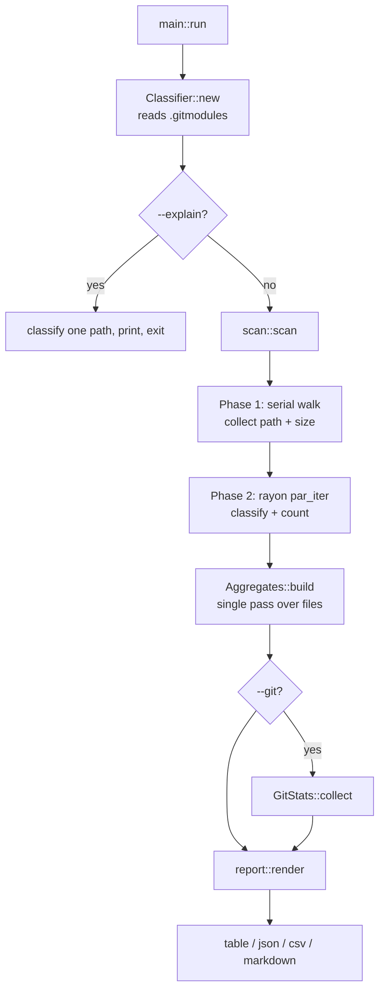

# devstat Internals

How the tool is built, why it is built that way, and where to change it.

For usage, see [docs/GUIDE.md](docs/GUIDE.md).

**Contents**

1. [Design principles](#1-design-principles)
2. [Module map](#2-module-map)
3. [The pipeline](#3-the-pipeline)
4. [Phase 1 — the walk](#4-phase-1--the-walk)
5. [Phase 2 — measurement](#5-phase-2--measurement)
6. [Classification](#6-classification)
7. [Language detection](#7-language-detection)
8. [The line counter](#8-the-line-counter)
9. [Aggregation](#9-aggregation)
10. [Rendering](#10-rendering)
11. [Git statistics](#11-git-statistics)
12. [Performance](#12-performance)
13. [Extending devstat](#13-extending-devstat)
14. [Testing](#14-testing)
15. [Deliberate trade-offs](#15-deliberate-trade-offs)

---

## 1. Design principles

Four rules shaped every decision in the codebase.

**Position decides authorship.** A file's role comes from where it sits in the
tree. Nothing infers authorship from file size, line count, or how
"library-like" the code looks. The predecessor of this tool classified any
header over 4,000 lines as vendor code, which meant a large project header was
credited to a dependency and a small vendored file was credited to the
developer. Both errors are invisible in the output. Path-based rules are
occasionally wrong too — but wrong in a way you can *see*, *explain*, and
*override*.

**Every decision carries a reason.** `Classification` pairs a `Role` with a
`&'static str` explaining which rule fired. It costs nothing (static strings, no
allocation per file) and it is what makes `--explain` and the `reason` field in
JSON possible. A statistic you cannot audit is a statistic you cannot trust.

**Never open a file you don't need.** Build output is measured by size alone.
This is not only a performance decision — a line count of compiler output is
meaningless — but it is the reason a multi-gigabyte build tree costs
milliseconds instead of minutes.

**Degrade, don't fail.** An unreadable file, a missing `git`, a permission error
mid-walk: each is recorded and the run completes. The only fatal errors are a
bad root path, a malformed glob, and an empty result set.

---

## 2. Module map

```
src/
  main.rs       182   CLI wiring, one-shot modes (--explain, --list-languages)
  cli.rs        201   clap derive definitions; nothing else
  lang.rs       235   86-language table + extension/filename lookup
  classify.rs   558   Role assignment — the core of the tool
  count.rs      201   Per-line code/comment/blank scanner
  scan.rs       185   Traversal and per-file measurement
  report.rs     742   Aggregation + table/JSON/CSV/markdown rendering
  git.rs        113   Optional `git` shell-outs
```

Dependencies, all of them load-bearing:

| Crate | Used for |
|---|---|
| `clap` (derive) | Argument parsing, `--help`, `--version` |
| `ignore` | Gitignore-aware parallel-capable directory walking |
| `globset` | `--include` / `--exclude` matching |
| `comfy-table` | Terminal and markdown table layout |
| `colored` | ANSI colour with a global override switch |
| `rayon` | Data-parallel measurement |

There is no `serde`. JSON output is hand-written in `report.rs` — the schema is
fixed and small, and avoiding the derive macro keeps the dependency tree and
build time down. `esc()` handles quotes, backslashes, newlines and control
characters; `report::tests::escapes_json` covers it.

---

## 3. The pipeline



The two phases are split for three reasons: the walk is I/O-bound and mostly
serial anyway, the classifier's memoised lookups warm up better when files
arrive grouped by directory, and rayon needs a materialised collection to
partition.

---

## 4. Phase 1 — the walk

`scan::scan` builds an `ignore::WalkBuilder` from `ScanOptions`:

```rust
walker
    .hidden(!opts.hidden)
    .parents(opts.respect_ignore)
    .git_ignore(opts.respect_ignore)
    .git_global(opts.respect_ignore)
    .git_exclude(opts.respect_ignore)
    .ignore(opts.respect_ignore)
    .follow_links(opts.follow_links);

walker.filter_entry(|e| e.file_name() != ".git");
```

The `.git` filter prunes the repository's object store early — thousands of
loose objects that would otherwise be stat'ed and discarded. Note this prunes
*nested* `.git` directories too, which is fine: nested-repo detection (§6) works
by direct filesystem probe, not by walking into them.

For each regular file the walk records `(relative_path, size)`. Paths are made
relative to the scan root immediately and stay relative for the rest of the
program — display, grouping, globbing and JSON all operate on the relative form,
so output does not leak the absolute path of the machine that produced it.

`--include`/`--exclude` are applied here, during the walk, so filtered files
never reach measurement. This is the difference between the glob flags and the
`--*-dir` flags: globs remove files from the report, overrides change their role.

Walk errors (permissions, broken symlinks) increment `walk_errors` and are
surfaced in the JSON summary rather than aborting.

**Known headroom:** phase 1 is single-threaded. `ignore` offers `build_parallel`,
which would need a channel or a `ParallelVisitor`. On the trees measured so far
the walk is not the bottleneck (§12), so the simpler code won.

---

## 5. Phase 2 — measurement

`candidates.into_par_iter().map(measure)` — rayon fans out across cores. Each
call to `measure` returns `(FileStat, Option<(PathBuf, String)>)`, the second
element being a skip note collected into `Scan::skipped` for `-v`.

`measure` is where the "never open a file you don't need" rule lives:

```rust
let provisional = classifier.classify(&rel, None);   // path only — no I/O
…
if !wants_lines(stat.role, language, opts) {
    return (stat, None);                              // file never opened
}
```

`wants_lines` returns false when the file has no recognised language, when its
language is an asset kind, when the role is `Build` or `Asset`, or when `--fast`
is set and the role is `Vendor`/`Generated`.

If the file *does* need counting it is read **once**, in full, into a `Vec<u8>`:

1. `count::is_binary` scans the first 8 KiB for a NUL byte. Binary files are
   recorded as skipped and sized only.
2. `String::from_utf8_lossy` decodes. Invalid sequences become replacement
   characters rather than an error — a stray Latin-1 byte should not lose you a
   whole file's count.
3. If marker detection is on, the file is **classified a second time**, now with
   its first 512 characters as `head`.
4. `count::count` produces the line split.

### Why classify twice

The generator-banner rule is the only rule that needs file content. Running the
path-only pass first means the second pass costs no extra I/O — the bytes are
already in hand — while files ruled out by path never get read at all.

The second pass can only ever *demote* a file into `Generated`; a banner cannot
promote anything. If it demotes, `wants_lines` is re-checked, so a `@generated`
file under `--fast` is dropped without being counted.

`HEAD_PROBE` is 512 **characters** (`char_indices().nth(512)`), not bytes, which
keeps the slice on a UTF-8 boundary for free.

---

## 6. Classification

`classify.rs` is the heart of the tool. `Classifier` holds the scan root, the
four override lists, the compiled globsets, the parsed submodule paths, and a
memo table:

```rust
pub struct Classifier {
    root: PathBuf,
    vendor_dirs: Vec<String>,
    build_dirs: Vec<String>,
    source_dirs: Vec<String>,
    generated_dirs: Vec<String>,
    exclude: Option<GlobSet>,
    include: Option<GlobSet>,
    submodules: Vec<PathBuf>,
    nested_repos: Mutex<HashMap<PathBuf, bool>>,
    detect_markers: bool,
    treat_tests_as_source: bool,
}
```

The `Mutex` is what makes `&Classifier` `Sync`, so a single instance is shared
across every rayon worker without cloning.

Construction is a builder chain in `main::run`; override names are lowercased
once at build time so the hot path compares against pre-normalised strings.

### Precedence

`classify()` lowercases the path's directory components once, then applies:

| Order | Rule | Wins because |
|---|---|---|
| 0 | `--source-dir` | An explicit user statement outranks every inference |
| 1 | Build output | A dependency's `build/` is still build output |
| 2 | Vendor | Third-party source outranks any naming coincidence inside it |
| 3 | Generated | Generator output inside your own `src/` is still not yours |
| 4 | File kind | Docs / Config / Asset / Other by extension |
| 5 | Source vs Test | Only reached for code files outside all of the above |

Step 1-before-2 is the fix for the specific failure this rewrite addressed:
`third_party/bgfx/build/gen.cpp` is **Build output**, not Vendor. There is a test
pinning exactly that (`classify::tests::build_wins_over_vendor`).

Each rule returns `Option<&'static str>` — `Some(reason)` on a match — so the
reason and the decision cannot drift apart.

### Rule sources

Six `const &[&str]` tables hold the directory vocabularies: `BUILD_DIRS`,
`BUILD_PREFIXES`, `VENDOR_DIRS`, `GENERATED_DIRS`, `TEST_DIRS`, `DOC_DIRS`,
`ASSET_DIRS`. Plus `GENERATED_SUFFIXES`, `GENERATED_PREFIXES` and
`GENERATED_MARKERS` for filename and content patterns.

`BUILD_PREFIXES` exists so `build`, `build-asan`, `build-ship`, `build_x64` and
`cmake-build-debug` all match without enumerating them.

### Nested repository detection

A vendored checkout often has an ordinary directory name. The signal that it is
not yours is that it carries its own `.git`:

```rust
fn in_nested_repo(&self, rel: &Path) -> bool {
    let mut current = rel.parent();
    while let Some(dir) = current {
        if dir.as_os_str().is_empty() { break; }      // reached the scan root
        // memoised: root.join(dir).join(".git").exists()
        if is_repo { return true; }
        current = dir.parent();
    }
    false
}
```

Walking up from each file would be O(files × depth) `stat` calls. The
`nested_repos` memo makes it O(distinct directories): a vendored repo with 5,000
files costs a handful of probes. It correctly catches both a `.git` directory
(a plain nested clone) and a `.git` *file* (a real git submodule's gitlink),
because `.exists()` does not care which.

`read_submodules` parses `path = …` lines out of the root `.gitmodules` for an
explicit, better-worded reason string when that file is present.

### Docs absorb code

One non-obvious rule: a code file under `docs/` is classified `Docs`, not
`Source`. Generated doc sites and vendored themes live there and are a common
inflation source, and example snippets are arguably documentation. It is the
conservative direction — it can only *deflate* the headline figure, never
inflate it — and `--source-dir docs` reverses it.

---

## 7. Language detection

`lang.rs` holds a `static LANGUAGES: &[Language]` built through a small `lang!`
macro. Each entry carries its name, `FileKind`, line-comment tokens,
block-comment pairs, string-quote bytes, extensions and exact filenames.

Two `OnceLock<HashMap<&str, &Language>>` indexes are built on first use — one by
extension, one by exact filename. `or_insert` means the first language listing an
extension wins, so ordering in the table is the tie-breaker.

`detect()` resolves in this order:

1. exact filename — `CMakeLists.txt`, `Makefile`, `Dockerfile`, `LICENSE`
2. filename up to the first `.` — catches `Dockerfile.dev`, `README.md`
3. extension, case-sensitive — lets `.S` and `.s` differ
4. extension, lowercased — catches `.PNG`, `.CPP`

`FileKind` (`Code`, `Docs`, `Config`, `Asset`, `Other`) is the bridge into
classification step 4, and is also what stops assets from ever being opened.

---

## 8. The line counter

`count::count` is a per-line state machine with two pieces of state carried
across lines (`in_block`) and within a line (`in_string`).

```
for each line, trimmed:
    empty?           → comment if inside a block, else blank
    scan bytes:
        in block     → look only for the terminator
        in string    → look only for the closing quote (backslash escapes skip)
        line-comment token at cursor  → has_comment, stop scanning this line
        block-open at cursor          → has_comment, enter block
        quote byte at cursor          → has_code, enter string
        non-whitespace                → has_code
    has_code ? code : has_comment ? comment : blank
```

Three details matter:

**String tracking is not optional.** Without it, `const char* u =
"http://example.com";` reads as a comment at the `//`. In a C++ codebase full of
URLs that is a large, systematic error. `count::tests::url_in_a_string_is_not_a_comment`
pins it.

**Quote sets are per-language.** Rust uses `"` only, because `'` is a lifetime
(`&'a str`) and treating it as a string opener would swallow the rest of the
line. C-family, Python and shell use `"` and `'`. Markup languages use none.

**UTF-8 safety is explicit.** The scanner indexes by byte for speed, and `step()`
returns the width of the sequence at the cursor from its lead byte, so the
cursor always lands on a character boundary. `&line[i..]` would panic otherwise.
`count::tests::multibyte_content_does_not_panic` covers it.

A line containing any code counts as code even with a trailing comment — the
`cloc`/`tokei` convention.

---

## 9. Aggregation

`Aggregates::build` makes **one pass** over `Scan::files`, filling four
`HashMap`s (language, role, directory) and two running totals. `project_roles` is
computed up front from `--include-vendor`/`--include-generated`, so "does this
count?" is one `Vec::contains` per file rather than a branch tree.

`group_key` collapses a path to its grouping directory:

```rust
let take = depth.max(1).min(parts.len());
parts[..take].join("/")
```

The `.min(parts.len())` matters — a file at `src/main.rs` under `--depth 3`
groups as `src`, not a padded phantom path. Files directly in the scan root
group as `.`.

`Role` derives `Ord` from its declaration order, so `by_role.sort_by_key` yields
Source → Tests → Vendor → Generated → Build → Docs → Config → Assets → Other with
no explicit ranking function. Reordering the enum reorders the report.

The largest-files list is only materialised when `--largest-files > 0`.

---

## 10. Rendering

`report::render` dispatches on `Format`. `Table` and `Markdown` share
`render_tables` and differ only by comfy-table preset (`UTF8_FULL` vs
`ASCII_MARKDOWN`) and a handful of `if md` branches for headings and the summary.

Two formatting details worth knowing if you touch this file:

**Pad before colouring.** ANSI escapes count towards `{:>width$}`, so
`format!("{:>9}", s.green())` produces ragged columns. `print_summary` computes
the value width, pads the plain string, and applies colour afterwards:

```rust
let row = |label: &str, value: String, paint: fn(String) -> ColoredString, note: String| {
    println!("  {}  {}  {}",
        format!("{label:<14}").bold(),
        paint(format!("{value:>value_width$}")),
        note.dimmed());
};
```

**Colour is disabled globally, once.** `main` calls
`colored::control::set_override(false)` when `--no-color` is set, when `NO_COLOR`
is in the environment, or when the format is anything but `table`. Nothing
downstream has to think about it.

The `Build output` row prints `—` rather than `0` in its code columns, because
those files were never read. A `0` would be a claim; `—` is the truth.

---

## 11. Git statistics

`git.rs` shells out to `git -C <root> …` and is entirely optional. `collect()`
returns `Option<GitStats>` and starts with `rev-parse --is-inside-work-tree`; any
non-`true` answer, missing binary or non-zero exit short-circuits to `None` and
the section is simply absent.

Individual fields degrade independently — a repository with no commits yet
reports zeros and `unknown` dates rather than failing.

`shortlog -sne --all HEAD` supplies both the contributor count and the top-five
list; email addresses are stripped at the `<`.

---

## 12. Performance

Measured on the Cargo registry source tree (macOS, release build):

```
82,115 files · 1.79 GB · 4.4 s wall · 302 % CPU
```

Where the time goes, and what keeps it down:

| Decision | Effect |
|---|---|
| Build output sized, never read | The dominant win on real projects — 6 GB of build tree costs a `stat` per file |
| Assets never read | Textures and models are pure size |
| Path-only classification first | No file is opened to find out it doesn't need opening |
| Single read per counted file | Marker detection reuses the same buffer |
| Memoised nested-repo probes | O(directories), not O(files × depth) |
| Lowercased overrides at build time | No per-file allocation in the hot path |
| `rayon` on phase 2 | ~3× on a multicore machine |

`--fast` skips line-counting for vendor and generated trees when you only need
your own numbers from a tree with a very large `node_modules`.

---

## 13. Extending devstat

### Add a language

One entry in `LANGUAGES` in `lang.rs`:

```rust
lang!("Odin", Code, C_LINE, C_BLOCK, DQ, &["odin"]),
```

Arguments are name, `FileKind`, line-comment tokens, block-comment pairs, quote
bytes, extensions, and optionally exact filenames. Shared constants (`C_LINE`,
`HASH`, `DQ`, `DQSQ`, `NO_BLOCK`, `NO_Q`) cover most cases. `--list-languages`
picks it up with no other change.

Pick quote bytes carefully: if the language uses `'` for something that is not a
string (Rust lifetimes, Haskell primes), leave it out.

### Add a classification rule

Append to the relevant `const` table in `classify.rs`. If the rule needs new
logic rather than a new name, add it inside the matching `*_reason` method and
return a new `&'static str`. Reason strings are the user-facing contract for
`--explain` and the JSON `reason` field — write them as a sentence fragment that
completes "because it is …".

If the rule needs to run at a different precedence, move its call in `classify()`
and add a test asserting the new ordering against the old one.

### Add an output format

Add a `Format` variant in `cli.rs`, then a `render_*` function and a match arm in
`report::render`. Aggregation is already format-agnostic; nothing else changes.

### Add a report section

Add a `View` variant in `cli.rs`, a match arm in `render_tables`, and — if the
section should appear by default — add it to `Args::views()`.

---

## 14. Testing

25 unit tests live beside the code they cover.

**`classify.rs` (12 tests)** — the ones that matter most, because they pin the
behaviour this rewrite existed to fix:

- `vendored_engines_are_not_project_code` — bgfx, Jolt, ImGui, GLFW, node_modules
- `a_large_project_header_is_still_project_code` — the size heuristic is gone
- `build_variants_are_all_build_output` — six directory spellings
- `build_wins_over_vendor` — precedence, not just membership
- `generated_sources_are_separated`, `generator_banner_is_detected`
- `tests_are_split_from_source`, `tests_can_be_folded_into_source`
- `source_dir_override_rescues_a_vendor_named_directory`
- `vendor_dir_override_adds_a_directory`
- `only_source_and_tests_count_as_project_code`

These construct a `Classifier` on a non-existent root, which is legitimate:
classification is pure path logic, and the nested-repo probe correctly returns
false for a path that isn't there.

**`count.rs` (8 tests)** — the code/comment/blank split, multi-line blocks, code
after a closing block, URLs in strings, escaped quotes, hash comments, multibyte
safety, binary detection.

**`report.rs` (5 tests)** — digit grouping, byte formatting, `group_key` depth
clamping, JSON escaping, CSV quoting.

```bash
cargo test --release
```

### End-to-end check

The rewrite was validated against a generated fixture reproducing the original
report: five vendored engines under `third_party/`, three build directories,
protobuf and moc output, and a deliberately large project header.

| | naive count | devstat |
|---|---|---|
| attributed to the developer | 275,033 | **6,026** |
| vendored | — | 80,000 |
| build output | counted as code | 3.1 MB, 90 files, never read |
| 6,001-line project header | vendor (size heuristic) | **Source** |

---

## 15. Deliberate trade-offs

Things that look like gaps and are choices:

**Approximate line counting.** A real parser per language would cost an order of
magnitude more code and would still need a fallback. devstat's job is to make a
tree's *proportions* trustworthy; for an exact count of one language, use that
language's tooling.

**Hand-written JSON.** The schema is fixed and small. `serde` + `serde_derive`
would add build time and a proc-macro dependency for output that fits in one
function with one tested escape helper.

**Serial phase 1.** `build_parallel` would need a channel or visitor. On measured
trees the walk is not the bottleneck; the simpler code is easier to reason about.

**Ambiguous directory names resolved conservatively.** `packages`, `contrib`,
`sdk` and `gen` are treated as not-yours. Some projects use them for their own
code, and those projects get a number that is too *low* — visibly, in a labelled
row, fixable with one flag. The opposite error is invisible.

**Docs absorb code.** Same reasoning, same direction: deflate rather than
inflate, and say so in the table.

**Whole-file reads.** Counted files are read into memory in full rather than
streamed. `--max-file-size` (16 MB default) bounds it, and the buffer is reused
for both marker detection and counting.

**No config file.** Every override is a flag, so any reported number can be
reproduced from the command line alone. A config file would make two runs of
`devstat` in two checkouts silently incomparable.
